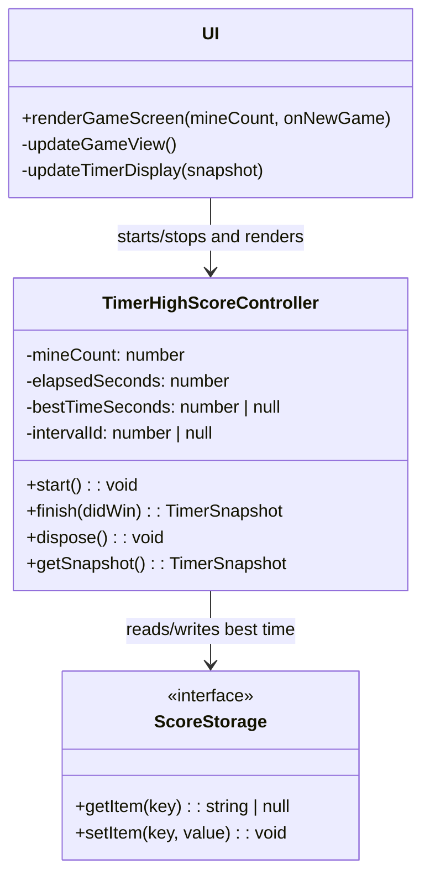
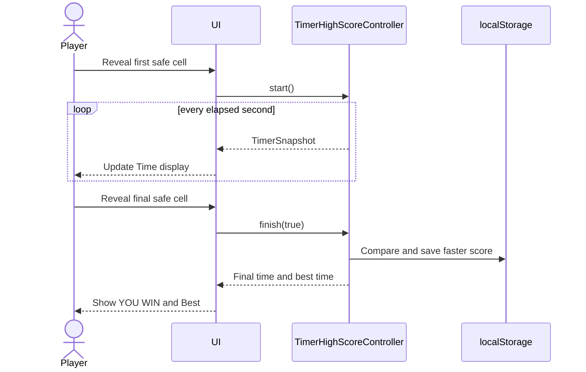

# Timer and High-Score Custom Addition

## Feature summary

The game clock begins after the first valid cell reveal, stops when the player wins or loses, and displays time as `MM:SS`. A winning round is compared with the saved record for the selected mine count. Only a faster time replaces the record, and scores persist in browser `localStorage` across page reloads.

## UML class diagram

## Sequence

## Design notes

- Scores are separated by mine count so games with different densities are compared fairly.
- Timer dependencies can be injected, allowing deterministic automated tests without waiting in real time.
- Storage parsing is defensive; invalid or unavailable browser storage does not crash the game.
- `dispose()` prevents an interval from continuing after the player leaves the game screen.

## Attribution

Original feature implementation by Cameren Green on October 1, 2026, created with assistance from OpenAI Codex. Standard browser timing and Web Storage APIs are used; no third-party code was copied.
